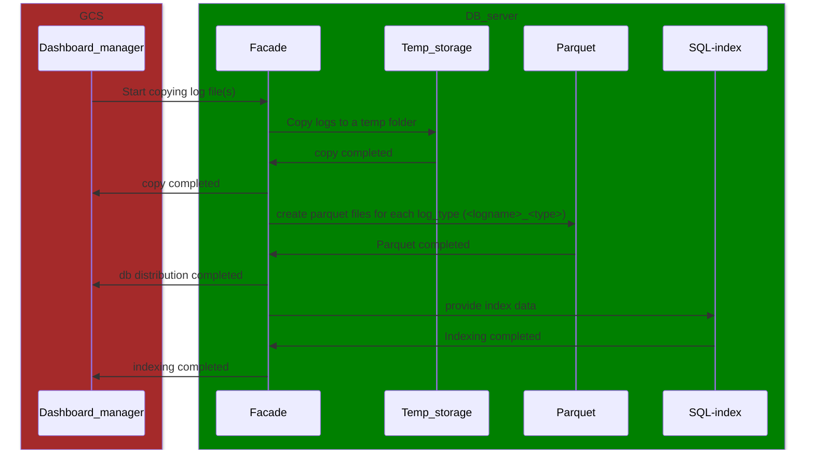

# ardulog_dashboard
The idea behind ardulog dashboard is that the server maintains all the logs in an effective manner.
It should be platform/software agnostic.

```mermaid
sequenceDiagram
    box Brown GCS
        participant Dashboard_manager
    end
    box Green DB_server
        participant Facade
        participant Temp_storage
        participant Parquet
        participant SQL-index
    end

    Dashboard_manager->>Facade: Start copying log file(s)
    Facade->>Temp_storage: Copy logs to a temp folder
    Temp_storage->>Facade: copy completed
    Facade->>Dashboard_manager: copy completed
    Facade->>Parquet: create parquet files for each log_type (<logname>_<type>)
    Parquet->>Facade: Parquet completed
    Facade->>Dashboard_manager: db distribution completed
    Facade->>SQL-index: provide index data
    SQL-index->>Facade: Indexing completed
    Facade->>Dashboard_manager: indexing completed
```
